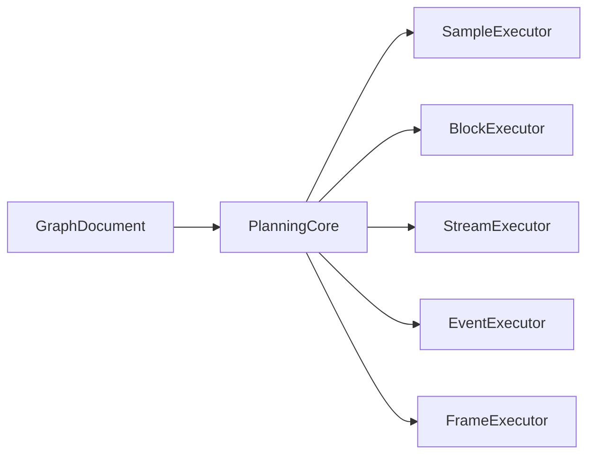

# CPU elemental model (host, streams, resources)

**Status:** architecture ADR (**accepted, pending implementation**) · **Scope:** canonical
patterns shared by CPU-side graph execution — schedule modes, host ports, typed resources,
build/query primitives, planning core + executors, sinks, and editor presentation. Part of the
[Procedural Graph System](./README.md).

> **Authority:** When a domain spec ([stream-graphs](./stream-graphs.md),
> [audio-graphs](./audio-graphs.md), [picking-and-collision](./picking-and-collision.md),
> [mesh-geometry-and-navigation](./mesh-geometry-and-navigation.md),
> [preview-monitors](./preview-monitors.md)) duplicates rules defined here, **this document
> wins**. Domain specs cover vertical slices, phases, and stdlib primitives only.
>
> Consolidation rationale: [spec-consolidation-2026-07.md](./spec-consolidation-2026-07.md).

## Summary

GPU elemental contracts landed in Foundation 1–2 (`TypeRef`, `sink`, `resource`, frame graph).
CPU/stream/mesh/nav work introduced parallel specs with repeated patterns. This ADR extracts
**one elemental layer** for:

1. **Schedule modes** — how often a consumer runs
2. **Host ports** — symmetric ingress (`host-input`) and egress (`signal` / `sink.host`)
3. **Typed resources** — mesh, partition kinds, spatial schemas, nav views — handles + `revision`
4. **Build vs query** — expensive bakes vs cheap lookups via **typed primitives**
5. **Planning core + executors** — shared dependency planning; schedule-specific runtime loops
6. **Sink families** — render, egress, export, bind (observation is editor-only)
7. **Session presentation** — probes, overlays, pop-out surfaces (not `GraphDocument`)

**Implementation gate:** E0 accepted. **E1** blocked until rev. 3 (F2-aligned resource model,
revision on bindings, host binding extension) lands in this ADR — then `packages/graph` types.

## Schedule modes

Do not collapse these — each has different executor rules:

| Mode | Granularity | Examples |
|------|-------------|----------|
| **`sample`** | One procedural context (uv, position, …) | `evalGraph`, scalar heatmap |
| **`block`** | Fixed `N` items per tick | audio quantum, STFT window, heightfield tile |
| **`stream`** | Sequence of `T` (bounded or unbounded) | NER tokens, `ContactEvent`, waypoints |
| **`event`** | On demand | pick click, `spatial.pathPortals`, `partition.buildSolid` |
| **`frame`** | Display refresh | GPU pipeline, shared preview loop |

**Bridge:** `source.fromBlock` (stream) adapts block → stream; `stream.window` adapts stream → block.

## Resource model (F2 alignment)

**Decision (rev. 3):** CPU and GPU resources share one **session identity story** (`ResourceTemplate`,
`ResourceInstance`, lifetime, revision) — but **not** a fake unified `TypeRef { kind: 'resource' }`.
F2 landed [`ResourceShape`](../../../packages/graph/src/implementation.ts) as **GPU structural**
`buffer` | `texture` | `sampler` only. E1 extends that union; port wires use **`cpu-handle`**.

See [foundation-2-generic-resources-plan.md](./foundation-2-generic-resources-plan.md).

### ResourceShape (extend landed union)

```ts
// packages/graph — ResourceTemplate.shape
type ResourceShape =
  | { kind: 'buffer'; element: TypeRef; access: BufferAccess; usages: BufferUsage[] }
  | { kind: 'texture'; dimension: TextureDimension; sample: SampleType; ... }
  | { kind: 'sampler'; filtering: boolean; comparison: boolean }
  | { kind: 'cpu'; schema: CpuResourceSchema }

type CpuResourceSchema =
  | 'geometry.mesh' | 'geometry.polygon2d'
  | 'partition.solid' | 'partition.walkable' | 'partition.freeSpace'
  | 'spatial.bvh' | 'spatial.octree' | 'spatial.grid' | 'spatial.heightfield' | 'spatial.patchTree'
  | 'spatial.frustumHitSet'
  | 'nav.view' | 'collider.compound'
  | 'audio.buffer'
```

GPU resources keep **structural TypeRefs** on port wires (`buffer`, `texture`, `sampler`) — they
are **not** reduced to schema strings.

### Port wire TypeRef (E1)

```ts
| { kind: 'cpu-handle'; schema: CpuResourceSchema; revisionTracked?: true }
| { kind: 'stream'; element: TypeRef; ordered?: boolean; replayable?: boolean }
| { kind: 'future'; value: TypeRef }
| { kind: 'signal'; payload: TypeRef }   // egress edge type — see § Signal runtime model
```

Legacy `{ kind: 'mesh' }` on ports coerces to `{ kind: 'cpu-handle', schema: 'geometry.mesh' }`
for one release.

### Runtime handle

```ts
interface ResourceHandle {
  resourceId: string      // stable in session resource table
  revision: u32           // monotonic per resourceId
  schema: CpuResourceSchema
}
```

### Migration (E1)

| Today | E1 target |
|-------|-----------|
| `TypeRef { kind: 'mesh' }` on ports | `{ kind: 'cpu-handle', schema: 'geometry.mesh' }` (+ coercion alias) |
| `ResourceDependency` (`image`/`mesh`/`audio` in [`types.ts`](../../../packages/graph/src/types.ts)) | Session import table unchanged; runtime maps to `cpu-handle` or host file binding |
| `PrimitiveImplementation { kind: 'resource'; template }` | GPU: existing buffer/texture/sampler shape; CPU: `{ kind: 'cpu', schema }` |
| GPU frame graph instances | Unchanged F2 lifetime/history on buffer/texture/sampler |

### Revision semantics

| Mechanism | When |
|-----------|------|
| **Runtime cache key** | `(resourceId, revision)` for all build/query adapters |
| **Invalidation** | upstream bake bumps `revision` → downstream consumers mark dirty / rebuild lazily |
| **Plan-time pin** | `expectedRevision?: u32` on **`ResourceBinding` occurrence** only (debug/tests) |
| **Port capability** | `revisionTracked?: true` on `cpu-handle` ports — downstream may observe bumps |

```ts
interface ResourceBinding {
  resourceId: string
  access: ResourceAccess
  expectedRevision?: u32   // opt-in pin — not on reusable port TypeRef
}
```

Plan-time stale rejection applies only when `expectedRevision` is set on a binding. Normal graphs
rely on runtime invalidation when `revision` changes.

**Rules:**

- Document holds **topology** only — no live queues, promises, or vertex arrays in JSON.
- No `stream<any>` / `cpu-handle` without `schema`.
- Domain specs use friendly port names (`mesh`, `navGraph`); IR maps them to `cpu-handle { schema }` + semantics.

## TypeRef extensions (elemental)

E1 additions listed in § Resource model above. Existing GPU `buffer`, `texture`, `sampler` variants
unchanged.

## Host ports (symmetric)

**Extend landed types — do not replace.** [`HostBinding`](../../../packages/graph/src/implementation.ts)
covers GPU and CPU **ingress**; add **`HostEgressBinding`** for CPU **egress** (E2).

### Ingress — `HostBinding` (unchanged)

```ts
interface HostBinding {
  context:
    | 'invocation' | 'stage-builtin' | 'playback' | 'write-target'
    | 'read-resource' | 'interaction' | 'session'
  key: string
  stages?: ShaderStage[]
}
```

`host-input` primitives use `HostBinding`. GPU contexts (`stage-builtin`, `write-target`,
`read-resource`) remain on the landed type.

### Egress — `HostEgressBinding` (new, E2)

```ts
interface HostEgressBinding {
  context: 'ui' | 'scene' | 'session'
  key: string
}
```

`sink.host` + `signal.emit` use `HostEgressBinding`.

| Direction | Primitive | Binding type |
|-----------|-----------|--------------|
| **In** | `host-input` | `HostBinding` |
| **Out** | `sink.host` + `signal.emit` | `HostEgressBinding` |

**Bulk data** on `stream<T>` or typed resources; **signals** carry small payloads (`SpatialHit`,
`ResourceRevision`, progress). No JS callbacks in `GraphDocument`.

### Delivery policy (subscription override)

Used on stream edges and host subscriptions — overrides context default (see § Signal runtime model):

| Policy | Use |
|--------|-----|
| `each` | Low-rate auditable events |
| `batch` | Tables, validation lists |
| `latest` | Hover pick, meters, status |
| `debounce(ms)` | Live typing |

## Signal runtime model

`signal<T>` is an **egress edge type** in the IR, not a persistent queue in `GraphDocument`.
Runtime semantics:

| Property | Decision |
|----------|----------|
| **Cardinality** | 0..N emissions per producer activation |
| **Buffer** | transient **per-executor emission buffer** drained by host adapter after producer tick |
| **Ordering** | FIFO per `(sourcePort, subscriptionId)` unless policy coalesces |
| **Lifetime** | payloads copied or interned at drain; no cross-frame retention unless host caches |
| **Errors** | producer error → `signal<ErrorReport>` or failed `future`; subscription handler errors isolated |

### Context-specific drain (defaults)

Delivery is **context-specific** — not universal `requestAnimationFrame`:

| Host context | Default drain policy |
|--------------|---------------------|
| `ui` | batch to rAF (one flush per subscription) |
| `interaction` | immediate or `latest` (pick hover) |
| `playback` / audio worklet | audio quantum boundary; **no rAF** |
| `scene` / fixed-step sim | sim tick / physics step |
| `session` | immediate on bake complete |

`DeliveryPolicy` (`each` | `batch` | `latest` | `debounce`) is a **subscription override** atop
these defaults. [stream-graphs.md](./stream-graphs.md) documents operator usage; rules live here.

## Partition kinds (shared machinery)

Collider decomposition partitions **occupied solids**; navigation requires **traversable
surfaces** or **free air volumes**. One partition resource cannot serve both without conflating
semantics — e.g. cave nav portals through solid hull walls.

**Shared machinery:** `ConvexPart`, adjacency extraction, portal width params, `revision`,
WASM decomp adapters. **Distinct partition kinds** with plan-time view restrictions:

| Kind | Source geometry | Semantics | Permitted views |
|------|-----------------|-----------|-----------------|
| **`partition.solid`** | closed mesh / occupied volume | quasi-convex **solid** hulls for collision | `partition.toCollider` only |
| **`partition.walkable`** | walk mesh, navmesh bake, 2D footprint | **traversable surface** cells + surface portals | `partition.toNav` only |
| **`partition.freeSpace`** | inverted / voxel / CSG void (caves) | **free air** volumes between obstacles | `partition.toNav` (3D funnel / corridor nav) |

**Rules:**

- **No** `partition.toNav` from `partition.solid` — plan-time type error.
- **No** `partition.toCollider` from `partition.walkable` or `partition.freeSpace`.
- Cave nav: portals connect **free-space** or **walkable-surface** cells; solid hulls are
  physics-only shells, not nav cells.
- Optional **`partition.align`** links solid + walkable partitions from the same authorship
  (metadata only — does **not** merge resources).

```ts
// Shared payload shape (schema discriminates kind)
PartitionPayload {
  revision: u32
  kind: 'solid' | 'walkable' | 'freeSpace'
  parts: ConvexPart[]
  adjacency: CellAdjacency
  portals: Portal[]         // walkable / freeSpace only; params: minPortalWidth
}
```

| Build primitive | Input | Output schema |
|-----------------|-------|---------------|
| `partition.buildSolid` | `geometry.mesh` | `partition.solid` |
| `partition.buildWalkable` | `geometry.mesh` \| `geometry.polygon2d` | `partition.walkable` |
| `partition.buildFreeSpace` | `geometry.mesh` \| voxel field | `partition.freeSpace` |
| `partition.toCollider` | `partition.solid` | `collider.compound` |
| `partition.toNav` | `partition.walkable` \| `partition.freeSpace` | `nav.view` |
| `partition.align` | two partition handles | link metadata (optional) |

Replaces separate `mesh.decomposeQuasiConvex` + `nav.fromDecomp` + `nav.extractPortals` pipelines
when kinds are chosen correctly — see [spec-consolidation-2026-07.md](./spec-consolidation-2026-07.md).

**Cave / freeSpace input semantics** (detail in
[mesh-geometry-and-navigation.md](./mesh-geometry-and-navigation.md)): mesh input is the oriented
boundary of **traversable volume**; voxel path uses occupancy + seed rules; nav builds apply
`agentRadius` erosion and portal clearance.

## Spatial and geometry primitives (typed)

Generic op-dispatch nodes (`spatial.query { op }`, `geometry.transform { op }`) conflict with
**static port typing** in the primitive registry. Author-facing contract: **concrete typed
primitives**; shared runtime adapters may dispatch WASM internally.

### Spatial build

| Primitive | Output schema |
|-----------|---------------|
| `spatial.buildBvh` | `spatial.bvh` |
| `spatial.buildOctree` | `spatial.octree` |
| `spatial.buildGrid` | `spatial.grid` |
| `spatial.buildHeightfield` | `spatial.heightfield` |
| `spatial.buildPatchTree` | `spatial.patchTree` |

### Spatial query (static ports — one fixed output each)

| Primitive | Inputs | Output |
|-----------|--------|--------|
| `spatial.ray` | `spatial.bvh` + `Ray` | `SpatialHit` (Mode B / mesh BVH) |
| `spatial.rayField` | `PortRef` position (+ optional normal) + `Ray` | `SpatialHit` (Mode A field march; no BVH) |
| `spatial.sampleHeight` | `spatial.heightfield` + `vec2f` | `f32` (+ optional normal port) |
| `spatial.frustum` | `spatial.bvh` + `Frustum` | `FrustumHitSet` (`cpu-handle`) |
| `spatial.pathPortals` | `nav.view` + start/goal | `SpatialPath` struct |
| `spatial.pathToWaypoints` | `SpatialPath` | `stream<Waypoint>` |

**Subtyping:** `spatial.sampleHeight` rejects `spatial.bvh` at plan time — `schema` on `cpu-handle`,
not a loose family tag.

| Domain use | Typed mapping |
|------------|---------------|
| Pick (Mode B) | `spatial.ray` |
| Pick (Mode A) | `spatial.rayField` |
| Walk | `spatial.buildHeightfield` + `spatial.sampleHeight` |
| Nav A* | `spatial.pathPortals`; stream legs via `spatial.pathToWaypoints` |
| Cull | `spatial.frustum` → `FrustumHitSet` |

Legacy names (`pick.mesh`, `accel.buildBvh`, `nav.pathQuery`) map to these primitives + consumer
profiles — not separate resource silos.

### Geometry transform (typed)

| Primitive | Input → output |
|-----------|----------------|
| `geometry.decimate` | `geometry.mesh` → `geometry.mesh` |
| `geometry.booleanUnion` | mesh × 2 → mesh |
| `geometry.booleanSubtract` | mesh × 2 → mesh |
| `geometry.booleanIntersection` | mesh × 2 → mesh |
| `geometry.convexHull` | `geometry.mesh` → `geometry.mesh` |
| `geometry.convexHullCollider` | `geometry.mesh` → `collider.compound` |
| `geometry.repair` / `geometry.weld` / `geometry.genNormals` | mesh → mesh |

`geometry.convexHullCollider` may share WASM adapter with `geometry.convexHull`. Heavy ops →
`async.spawn` → `future`. Aliases (`mesh.decimate`) register as editor-friendly ids.

## Planning core and executors

**One planning core**, **schedule-specific executors** — not a monolithic CPU loop.



**PlanningCore** (shared): dependency DAG, command topological order, hazard/disjoint writes
(F2 lifetime on CPU), `await` cycle detection, resource revision edges, batch independent `spawn`s.

**Executors** run producer ticks and drain signal emission buffers per schedule mode.

### Consumer profiles

```ts
interface ConsumerProfile {
  id: string
  schedule: 'sample' | 'block' | 'stream' | 'event' | 'frame'
  roots: 'sinks' | 'targets' | 'explicit'
  hostInputContexts?: HostBinding['context'][]
  hostEgressContexts?: HostEgressBinding['context'][]
  realtimeSafe?: boolean
  // Executor contract (E3):
  blockSize?: number
  backpressure?: 'drop' | 'block' | { buffer: number }
  queueOwner?: 'graph' | 'host'
  latencyClass?: 'realtime' | 'interactive' | 'offline'
  defaultDrainPolicy?: DeliveryPolicy  // override; else from host context
}
```

| Profile id | Schedule | Executor | Domain spec |
|------------|----------|----------|-------------|
| `eval.sample` | sample | SampleExecutor | (existing) |
| `audio.block` | block | BlockExecutor | [audio-graphs.md](./audio-graphs.md) |
| `stream.main` | stream | StreamExecutor | [stream-graphs.md](./stream-graphs.md) |
| `pick.event` | event | EventExecutor | [picking-and-collision.md](./picking-and-collision.md) |
| `partition.bake` | event | EventExecutor | [mesh-geometry-and-navigation.md](./mesh-geometry-and-navigation.md) |
| `nav.path` | event | EventExecutor | mesh-geometry |
| `preview.frame` | frame | FrameExecutor | GPU / shared preview loop |

## Async (elemental)

Generic primitives — not domain-specific:

| Primitive | Role |
|-----------|------|
| `async.spawn` | → `future<T>` |
| `async.await` / `async.awaitAll` / `async.tryAwait` | join |
| `async.join` | structural fan-in (planning) |

One worker pool per session; WASM via message passing in v1.

## Stream plumbing (elemental)

Generic stdlib — domain nodes compose these:

`stream.map`, `filter`, `mux`, `demux`, `window`, `batch`, `throttle`, `debounce`, `tap`.

**Open:** `flow.forEach` (static list) lowers to unrolled stream **or** block map — pick one before E1.

## Sink families

Extend existing `SinkDefinition`. **Observation is not a sink family** — preview monitors live
only under `SessionPresentation` ([preview-monitors.md](./preview-monitors.md)).

| Family | Examples | Execution root? |
|--------|----------|-----------------|
| **`render`** | `target.display`, `target.mesh` | Yes |
| **`egress`** | `sink.host` | Yes (stream/event) |
| **`export`** | `sink.audio`, file sinks | Yes |
| **`bind`** | `physics.bindCollider`, scene bind | Yes (bake) |

## Session presentation (editor — not IR)

`packages/graph-editor` owns observation without mutating `GraphDocument`:

```ts
interface SessionPresentation {
  observations: PreviewProbe[]           // port taps — not execution roots
  subscriptions: HostSignalSubscription[]
  overlays: Record<string, OverlayHandle>  // nav, path, portals — id + revision only
  surfaces: PresentationSurface[]        // panes + pop-out windows (future)
}
```

Pass **handles + revision** across panes/windows — never large buffers by value.

## Struct catalog (index)

Shared structs in `packages/graph` (or `@world-lab/schema`); domain specs reference ids:

| Struct id | Used by |
|-----------|---------|
| `SpatialHit` | `spatial.ray`, `spatial.rayField`, pick egress (replaces `PickResult`) |
| `SpatialPath` | `spatial.pathPortals` |
| `FrustumHitSet` | `spatial.frustum` output handle |
| `SpatialContact` | physics egress (`ContactEvent` alias) |
| `ResourceRevision` | partition/spatial bake complete / stale |
| `BakeProgress` | long WASM ops (decimate, decomp) |
| `Portal` / `NavCell` | partition kinds, nav |
| `DeliveryPolicy` | host + stream metadata |
| `ErrorReport` | failed signal / future egress |

`PickResult` is **deprecated** — use `SpatialHit` (same fields; one release alias in codegen).

Until schemas land in code, field lists remain in domain specs but **must align** with this index.

## Extraction roadmap

| Id | Deliverable | Depends on | Unblocks |
|----|-------------|------------|----------|
| **E0** | ADR accepted; partition kinds + signal semantics | — | E1 |
| **E1** | `cpu-handle`, stream/future/signal; extend `ResourceShape` + `ResourceBinding.expectedRevision` | E0 rev. 3 | all CPU specs |
| **E2** | `HostEgressBinding`; `sink.host`; context-specific signal drain adapters | E1 | stream, pick, probes |
| **E3** | PlanningCore + executor registry + extended `ConsumerProfile` | E1 | audio, stream, pick |
| **E4** | Partition kinds + builders + typed views | E1 | mesh, nav, physics |
| **E5** | Typed spatial/geometry primitives + shared adapters | E1, E4 partial | pick, heightfield, nav |
| **E6** | Geometry WASM adapter behind typed primitives | E5 | mesh ops |
| **E7** | `SessionPresentation` | E2 | monitors, nav overlay, multi-window |
| **E8** | Shared struct catalog in `graph` | E1 | all egress payloads |

Domain spec phases map to E-blocks (e.g. stream Phase A ≈ E1 + E2). **Do not start E1 until rev. 3**
(F2 alignment, binding revision pin, host extension) is reflected in this ADR.

## Maintenance rule (agents)

> **New pattern** → extend this ADR. **New primitive or consumer phase** → extend the domain
> spec only. Never add a third copy of schedule modes, host egress, revision rules, partition
> kinds, or build/query split.

## Related docs

- [spec-consolidation-2026-07.md](./spec-consolidation-2026-07.md) — review memo, rev. 2–3 addenda
- [elemental-webgpu-architecture-review.md](./elemental-webgpu-architecture-review.md) — GPU elemental track
- [inputs-cpu-and-resources.md](./inputs-cpu-and-resources.md) — CPU runtime services
- [foundation-2-generic-resources-plan.md](./foundation-2-generic-resources-plan.md) — lifetime/history
- Domain specs: [stream-graphs](./stream-graphs.md), [audio-graphs](./audio-graphs.md),
  [picking-and-collision](./picking-and-collision.md), [mesh-geometry-and-navigation](./mesh-geometry-and-navigation.md),
  [preview-monitors](./preview-monitors.md)

## Open questions

1. **Host key registry** — central in graph-editor vs per-app only?
2. **`flow.forEach` vs `stream.map`** — single lowering path?
3. **`partition.align` persistence** — session metadata vs scene document field?

**Resolved (E0 + rev. 3):**

- ~~`opaque` vs F2 resource~~ → extend `ResourceShape` with `{ kind: 'cpu', schema }`; port type `cpu-handle`
- ~~Revision on TypeRef~~ → `expectedRevision` on `ResourceBinding`; `revisionTracked` on port only
- ~~Unified HostPortBinding~~ → landed `HostBinding` + new `HostEgressBinding`
- ~~`nav` as view only~~ → always `partition.toNav` from walkable or freeSpace; never from solid
- ~~Signal delivery~~ → context-specific drain; transient emission buffer per executor
- ~~Generic op nodes~~ → typed spatial/geometry primitives with fixed contracts
