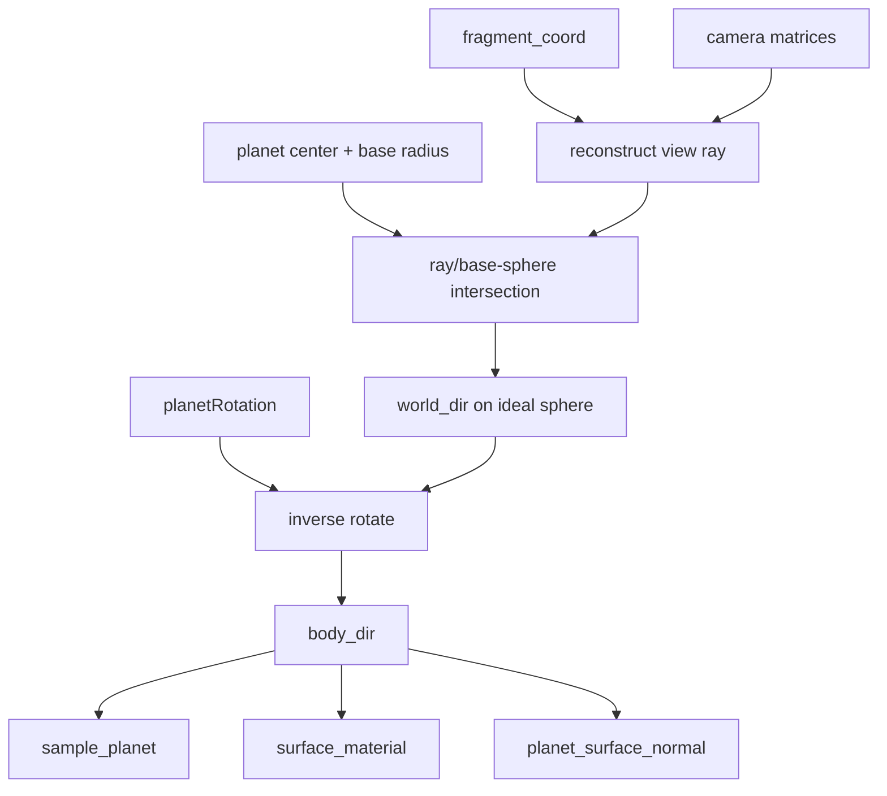

# Ideal-sphere fragment sampling

Status: design note for stabilizing procedural terrain against tessellation changes.

## Problem

Terrain sampling must not depend on tessellation density.

The current terrain shaders pass a direction from vertex to fragment and reuse that
interpolated value for procedural lookup:

- `cubeSphereVertex.wgsl` passes `body_dir`.
- `surfacePatchVertex.wgsl` passes a body-local `unit_dir`.
- Fragment code calls `sample_planet(...)`, `surface_material(...)`, and
  `planet_surface_normal(...)` from that interpolated direction.

That means the analytic coordinate can be influenced by the tessellated triangle. A
fragment on a low-resolution triangle lies on the rasterized triangle/chord, not on the
perfect sphere surface. If the fragment derives its noise coordinate from interpolated
or displaced triangle data, the sampled height/material can shift as tessellation
changes.

The symptom is terrain that changes when tessellation changes, even when the planet
parameters, camera, body transform, and LOD intent are otherwise the same.

## Required invariant

Procedural terrain sampling must start from an ideal sphere coordinate for the
fragment, not from the displaced or tessellated triangle coordinate.

Tessellation should control only:

- geometric approximation,
- depth approximation,
- silhouette quality,
- patch density/performance.

It must not change:

- the `body_dir` used by `sample_planet()`,
- the fragment-local height used for color/material decisions,
- material classification,
- normal finite differences,
- procedural texture-noise coordinates,
- biome/polar coordinates.

There are two different height uses:

- Vertex/tessellation height places the mesh. Each tessellated vertex still needs a
  terrain height so the triangle approximates the visible surface.
- Fragment height drives terrain analytics. Color, material, biome thresholds,
  procedural texture noise, and normal sampling should use a height recomputed from
  the fragment's ideal sphere coordinate.

The fragment must not treat interpolated vertex height as authoritative terrain data.
Interpolated height is only a rasterized approximation of the displaced mesh. It is
not the analytic height field.

## Correct sampling model

For each terrain fragment:

1. Use the fragment position and camera to reconstruct the view ray.
2. Intersect that ray with the ideal base sphere, using `planet.radius`.
3. Convert the ideal hit point to a world-oriented unit direction.
4. Rotate that direction by `inverse(planetRotation)` to get body-local `body_dir`.
5. Recompute `sample_planet(body_dir, ...)` for the fragment.
6. Use that fragment-local sample's `height_meters`, `world_radius_meters`, and
   material inputs for color/material/normal decisions.

In pseudocode:

```wgsl
let ray = reconstruct_view_ray(fragment_coord, inverse_view_projection);
let hit = intersect_ray_sphere(ray.origin, ray.direction, planet_center, planet.radius);
let world_dir = normalize(hit.position - planet_center);
let body_dir = rotate_vector_by_quat_inv(view_u.planet_rot, world_dir);

let sample = sample_planet(body_dir, planet, scale_ctx);
let height = sample.height_meters;
let material = surface_material(sample, planet, scale_ctx);
let n_body = planet_surface_normal(body_dir, planet, scale_ctx);
```

The exact reconstruction inputs can vary by pass, but the ownership rule should not:
fragment terrain analytics come from ideal sphere intersection, not from interpolated
mesh displacement.

## Vertex height vs fragment height

The vertex shader can still do this:

```wgsl
let vertex_body_dir = rotate_vector_by_quat_inv(view_u.planet_rot, vertex_world_dir);
let vertex_sample = sample_planet(vertex_body_dir, planet, scale_ctx);
let vertex_world_pos = vertex_world_dir * vertex_sample.world_radius_meters;
```

That is the geometry path. It determines where the tessellated mesh is drawn.

The fragment shader should not continue from an interpolated `vertex_sample`,
interpolated `height_meters`, or interpolated displaced position for material lookup.
It should do this instead:

```wgsl
let fragment_body_dir = ideal_sphere_fragment_body_dir(...);
let fragment_sample = sample_planet(fragment_body_dir, planet, scale_ctx);
let material = surface_material(fragment_sample, planet, scale_ctx);
```

This keeps the rendered color tied to the analytic terrain field. Geometry may still
be an approximation at low tessellation, but the material pattern does not crawl or
change because the mesh resolution changed.

## Current shader implication

Today the cube-sphere path does this in the fragment:

```wgsl
let sample = sample_planet(in.body_dir, planet, scale_ctx);
```

and the surface-patch path does this:

```wgsl
let sample = sample_planet(in.unit_dir, planet, scale_ctx);
```

Both values come from vertex outputs. Even if the vertex direction starts on the ideal
sphere, the rasterizer interpolates it across a flat triangle. That makes it an
approximation whose error changes with tessellation.

The graph should therefore replace the current fragment input with an
`IdealSphereFragmentCoordinate` node.

## Pipeline graph addition



This node belongs before `sample_planet()` in every fragment-stage terrain variant.
Vertex-stage sampling may still use patch/cube-sphere directions to place geometry,
but fragment-stage material and analytic terrain evaluation should use the ideal
fragment coordinate.

## Open implementation details

The design needs one implementation decision before code:

- Add inverse view-projection and viewport dimensions to `ViewUniforms`, then derive
  a ray from `@builtin(position).xy`.
- Or pass enough per-vertex ray data to reconstruct a perspective-correct ray in the
  fragment.

The first option is clearer and easier to test. It also fits the planned graph/compiler
model because `fragment_coord`, `inverse_view_projection`, `camera_pos`, `planet_center`,
and `planet.radius` are explicit inputs to the coordinate node.

## Acceptance criteria

- Changing tessellation resolution does not move terrain noise/material patterns.
- Fragment material/color decisions use the recomputed ideal-coordinate
  `sample_planet()` result, not interpolated vertex height.
- Debug `body_dir` and latitude/longitude grid views are stable across tessellation
  levels.
- Cube-sphere and surface-patch shaders derive fragment `body_dir` through the same
  graph node.
- Interpolated/displaced `world_pos` remains available for approximate depth and
  lighting position, but is not the authoritative procedural sampling coordinate.
