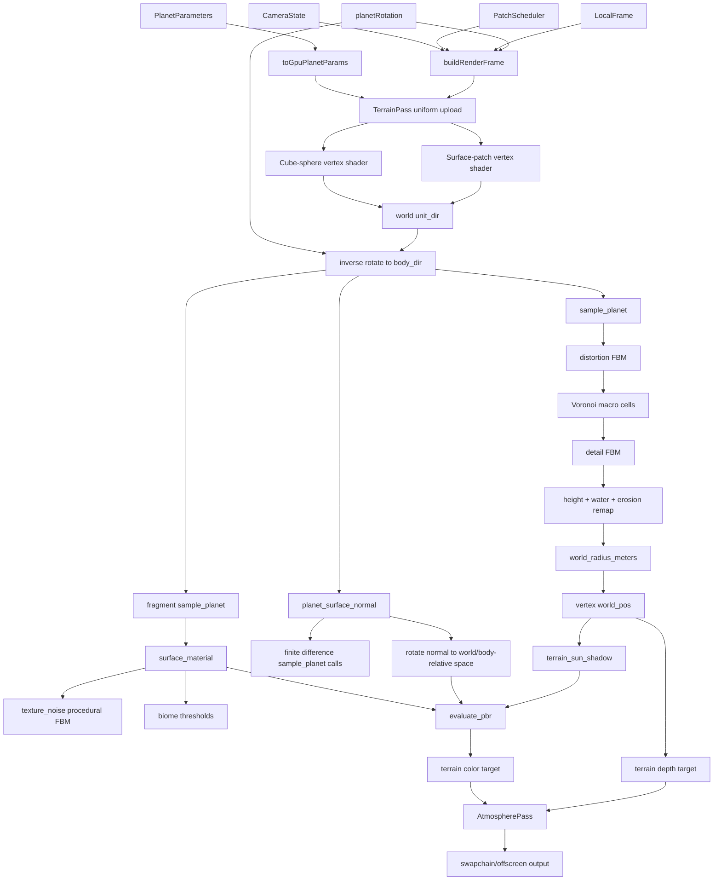
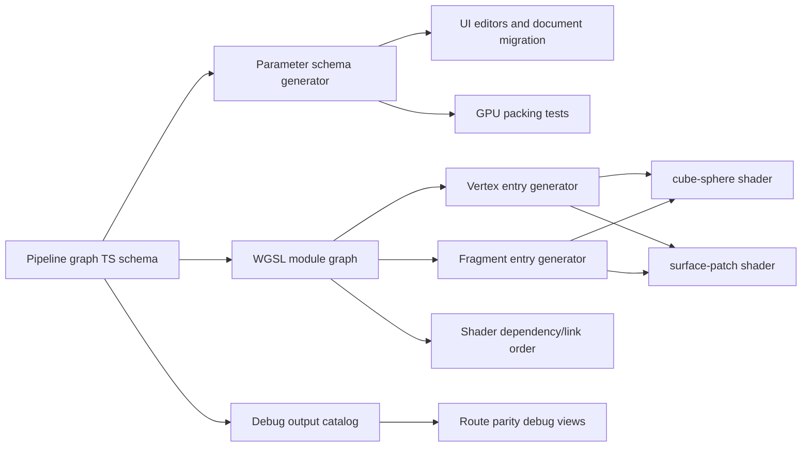

# Planet shaping pipeline graph

Status: current-state report plus componentization design.

This document answers two questions raised by the `/scene` terrain mismatch:

1. Are planet shape and material generated through baked textures?
2. What graph should define planet shaping so `/planet`, `/scene`, and future shader
   variants cannot drift?

Related note: `_docs/ideal-sphere-fragment-sampling.md` documents the additional
requirement that fragment-stage terrain sampling must use an ideal sphere coordinate,
not an interpolated tessellated-triangle coordinate.

## Short answer

The active WebGPU renderer does not currently bake terrain or material textures for
planet shaping.

Terrain height, material fields, normals, and self-shadow inputs are evaluated
procedurally in WGSL at draw time. The textures currently involved in the active path
are render targets and pass inputs:

- `TerrainPass` renders terrain into a color texture and depth texture.
- `AtmospherePass` samples those terrain color/depth textures for full-screen
  atmospheric composition.
- `WebGPUBackend.renderToTexture()` can render to a provided texture for composition
  and tooling.

Those are frame/pass textures, not cached height, albedo, normal, biome, or lookup
textures for terrain generation.

The naming `texture_noise_*` is a procedural fine-noise material/relief layer. It is
not an uploaded or baked texture.

## Current source map

| Concern | Current files |
|---|---|
| Serializable shape parameters | `fe/src/lib/planet/params/planetParams.ts` |
| Preset values and radius-relative amplitudes | `fe/src/lib/planet/params/presets.ts` |
| Runtime layer gating metadata | `fe/src/lib/planet/planet/layers.ts` |
| Frame assembly | `fe/src/lib/planet/render/buildRenderFrame.ts` |
| Backend frame contract | `fe/src/lib/planet/render/RenderBackend.ts` |
| GPU buffer upload | `fe/src/lib/planet/render/passes/terrainPass.ts` |
| Cube-sphere terrain shader | `fe/src/lib/planet/gpu/wgsl/terrain/cubeSphereVertex.wgsl` |
| Surface-patch terrain shader | `fe/src/lib/planet/gpu/wgsl/terrain/surfacePatchVertex.wgsl` |
| Shape kernel | `fe/src/lib/planet/gpu/wgsl/planet/kernel.wgsl` |
| Material classification | `fe/src/lib/planet/gpu/wgsl/planet/material.wgsl` |
| Normal estimation | `fe/src/lib/planet/gpu/wgsl/planet/normal.wgsl` |
| Terrain self-shadow | `fe/src/lib/planet/gpu/wgsl/planet/shadow.wgsl` |
| Lighting | `fe/src/lib/planet/gpu/wgsl/planet/lighting.wgsl` |
| Atmosphere composite | `fe/src/lib/planet/gpu/wgsl/atmosphere/atmosphereFullscreen.wgsl` |
| WGSL include expansion | `fe/vite-wgsl.ts` |

## Current parameter contract

`PlanetParameters` is the shape/material input schema. `toGpuPlanetParams()` copies it
into the `PlanetParams` uniform block, with `time` appended for shader animation hooks.

| Parameter group | Fields | Current meaning |
|---|---|---|
| Radius | `radius` | Base sphere radius in renderer meters. |
| Macro cells | `voronoi_scale`, `voronoi_amplitude`, `voronoi_albedo`, `voronoi_albedo_y`, `voronoi_albedo_z` | Large terrain cells plus color bias. Amplitude is a ratio of radius in current presets. |
| Macro distortion | `voronoi_distortion_scale`, `voronoi_distortion_amplitude`, `voronoi_distortion_albedo` | Distorts the macro-cell sample domain and material color contribution. |
| Detail relief | `detail_scale`, `detail_amplitude`, `detail_albedo` | Secondary FBM relief and color contribution. Amplitude is a ratio of radius. |
| Water and erosion | `water_level`, `render_water`, `erosion` | Converts raw relief into water-clamped radius and an erosion value used by material classification. |
| Biome thresholds | `sand_cutoff`, `vegetation_level`, `snow_cover` | Material thresholds derived from erosion, pseudo-latitude, and elevation. |
| Fine texture noise | `texture_noise_scale`, `texture_noise_amplitude` | Procedural fine noise. Despite the name, this is not a GPU texture. Amplitude is a ratio of radius. |
| Polar shaping | `polar_scale`, `polar_amplitude` | Procedural polar material/height influence. |
| Lighting toggle | `illumination` | Renderer/material lighting control. This is not intrinsic shape and should move out of `PlanetParameters`. |

The current problem is not only incorrect signs or axis assignments. Those bugs are
possible because the coordinate-space and parameter contracts are implicit. A graph
schema should make spaces, units, dependencies, and shader-stage placement explicit.

## Current procedural graph

## Shader-stage placement today

The same conceptual pipeline is split across vertex and fragment work:

- Vertex stage:
  - builds the cube-sphere or surface-patch direction,
  - transforms world direction into body-local analytic direction with
    `inverse(planetRotation)`,
  - calls `sample_planet()`,
  - displaces geometry by `sample.world_radius_meters`.
- Fragment stage:
  - calls `sample_planet()` again for material inputs,
  - calls `surface_material()` for albedo/roughness/water,
  - calls `planet_surface_normal()` for body-local finite-difference normals,
  - rotates normals back through `planetRotation`,
  - evaluates terrain self-shadow and lighting.

This duplication is acceptable for now, but it is another reason a graph compiler is
useful. The compiler can generate consistent vertex and fragment entry points from the
same graph nodes, while allowing selected values to be interpolated when that is safe.

## Coordinate spaces that must be explicit

| Name | Meaning | Current risk |
|---|---|---|
| `world_dir` | Direction from planet center in renderer/world-oriented space. Geometry is placed here. | `/scene` and `/planet` can build this from different camera/body assumptions. |
| `body_dir` | Direction in the planet's intrinsic local frame. Procedural terrain must sample here. | Any missing inverse `planetRotation` makes terrain appear fixed in viewport/world space. |
| `world_pos` | Planet-relative rendered position after radius displacement. | Used for lighting/shadow/depth; must not become the analytic noise coordinate. |
| `body_pos` | Body-local position. Not consistently named today; currently often recoverable from `body_dir * radius`. | Needed for future graph clarity. |
| `ideal_fragment_body_dir` | Body-local direction reconstructed from the fragment coordinate intersected with the ideal base sphere. | Needed so terrain sampling does not change with tessellation density. |
| `height_meters` | Relief offset from base radius before water clamp. | Must stay separate from final render radius. |
| `world_radius_meters` | Rendered radius after relief/water. | Used by geometry and normal sampling. |
| `scale_ctx` | Camera/LOD context used to gate expensive layers. | Route-specific camera differences change visible layers. |

The componentized pipeline should reject a graph edge when the producer and consumer
spaces do not match, unless the graph contains an explicit transform node.

## Why the current bug can survive local fixes

Recent fixes pushed `planetRotation` deeper into `/scene` and into the terrain shader,
but the renderer still has multiple places that can diverge:

- `/planet` and `/scene` construct camera inputs differently.
- `/scene` still has body/viewport/style state split across route state, scene nodes,
  and overlay renderer inputs.
- Cube-sphere and surface-patch shaders are separate entry points with duplicated
  sampling logic.
- `PlanetParameters` mixes intrinsic body shape with renderer style
  (`illumination`).
- WGSL composition is textual `#include` expansion, not a typed graph with named
  spaces and ports.

That means a sign or rotation patch can fix one visible symptom while leaving the
pipeline vulnerable to another mismatch.

## Proposed component model

Introduce a `PlanetShapingPipeline` schema in TypeScript. It should be the source of
truth for:

- parameter names, units, defaults, ranges, and ownership,
- graph nodes and their dependency edges,
- coordinate-space types for every port,
- shader-stage eligibility,
- uniform/storage bindings required by each node,
- generated WGSL include order and entry-point helpers,
- debug material views derived from graph outputs.

Suggested first graph nodes:

| Node | Inputs | Outputs | Stage |
|---|---|---|---|
| `BodyDirection` | `world_dir`, `planetRotation` | `body_dir` | vertex + fragment |
| `IdealSphereFragmentCoordinate` | `fragment_coord`, camera matrices, planet center, base radius, `planetRotation` | `ideal_fragment_body_dir` | fragment |
| `LayerGate` | `scale_ctx`, `radius` | booleans per layer | vertex + fragment |
| `MacroDistortion` | `body_dir`, distortion params, layer gates | `distortion` | vertex + fragment |
| `MacroVoronoi` | `body_dir`, `distortion`, macro params | `vor` | vertex + fragment |
| `DetailFbm` | `body_dir`, detail params, layer gates | `detail` | vertex + fragment |
| `HeightRemap` | `vor`, `detail`, water/erosion params | `height_meters`, `water_height_meters`, `world_radius_meters`, `erosion_value` | vertex + fragment |
| `FineTextureNoise` | `body_dir`, texture-noise params, layer gates | `texture_noise` | fragment |
| `PolarTerm` | `body_dir`, polar params | `polar_value` | fragment |
| `BiomeMaterial` | shape sample, fine noise, polar term, biome params | albedo, roughness, water flag | fragment |
| `NormalEstimator` | `body_dir`, shape subgraph | body normal | fragment |
| `WorldNormal` | body normal, `planetRotation` | world/body-relative normal | fragment |
| `SelfShadow` | world/body position, light, shape subgraph | direct shadow factor | fragment |
| `PbrLighting` | material, normal, lights, shadow factor | terrain color | fragment |

This should generate the current cube-sphere and surface-patch shaders from one
shaping graph. The two terrain entry points can still differ in tessellation and patch
addressing, but not in analytic terrain meaning.

## Proposed compiler layers

The first compiler does not need to be complex. It can start as a declarative module
registry that emits:

- an ordered WGSL include list,
- generated struct/constant names for graph ports,
- generated wrapper functions for `sampleShape()`, `sampleMaterial()`, and
  `sampleNormal()`,
- tests that assert cube-sphere and surface-patch variants call the same shaping
  wrappers.

Later it can become a real shader linker with dead-code removal and variant emission.

## Use.GPU relevance

Use.GPU is relevant as architecture research. Its public documentation describes a
composable WebGPU system with live graph/shader construction, a built-in shader linker
and binding generator, and packages such as `@use-gpu/workbench` for render passes and
`@use-gpu/shader` for WGSL linking/tree shaking.

Direct adoption should be treated as a separate spike, not assumed:

- It has a React-like runtime called Live, while this app is Svelte-first.
- The documentation marks the project as alpha/work in progress.
- The strongest near-term fit is the shader-linking and binding-generation model,
  not replacing the Svelte route/component tree.

Recommended path:

1. Study Use.GPU's shader graph and pass-composition ideas.
2. Prototype a local `PlanetShapingPipeline` graph with our existing WGSL.
3. Only after the local graph exists, evaluate whether `@use-gpu/shader` or related
   packages can be used independently without adopting Live.

## Immediate bug-oriented next steps

1. Add a graph-derived debug material mode that visualizes `body_dir` as RGB and a
   latitude/longitude grid. The same debug output must render in `/planet` and
   `/scene`.
2. Route `/planet`, `FocusedBodyView`, and `ProceduralBodyLayer` through one shared
   focused-body camera builder so `scale_ctx` and visible layer gates match.
3. Split `PlanetParameters` into intrinsic shape/material parameters and renderer
   style settings. Move `illumination` out first because it is clearly not shape.
4. Generate cube-sphere and surface-patch shader wrappers from one graph module so
   terrain sampling, normals, and material classification cannot drift by hand.
5. Add parity tests that compare route inputs before GPU submission:
   same body, same transform, same camera, same style, same `RenderFrame`.

## Documentation conclusion

The current terrain mismatch is best treated as a pipeline-contract bug, not only as a
camera-control or quaternion bug. The renderer already has the ingredients for a clean
component model, but they are distributed across route state, frame assembly, pass
upload, and textual WGSL includes. A typed shaping graph gives us a single place to
define parameters, spaces, stage placement, and generated shader variants.
