# SunDog Solar Systems — catalog, galaxy map, and `/scene` integration

**Status:** implementation spec (re-anchored to the live repo) · **Scope:** new
`lib/planet/sundog/` data layer, a `scripts/sundog/` exporter, and a new
`/solar-systems` route · **Driver:** import the real SunDog: Frozen Legacy
star systems as selectable, persistent single-system scenes, preserving game
data for a future remake.

> **Provenance / permission.** The system, planet, and city data is extracted
> from a local copy of **SunDog: Resurrection (Beta 3.6, 14 Dec 2018)**, whose
> `databases/sundog.db` carries the same canonical data as the original game.
> Use of the real SunDog names and data here is **with Bruce Webster's approval**
> (original author/designer). Only *derived* catalog data is committed — never
> the Resurrection distribution itself (its README marks it a private
> distribution).

---

## 0. What already exists (read first)

This spec was originally written greenfield; the repo has since grown most of
the "scene" machinery. Build on it — do **not** introduce a parallel scene
model.

- **Scene model** — [`lib/planet/scene/types.ts`](../../fe/src/lib/planet/scene/types.ts):
  `PlanetScene = { rootId, nodes: Map<id, SceneNode> }`. `BodyNode` carries
  `bodyType: 'star' | 'planet' | 'gas_giant' | 'moon'`, `radiusMeters`,
  `appearance?: { preset, overrides }`, `atmosphere?`.
- **Orbits** — [`lib/planet/scene/orbit.ts`](../../fe/src/lib/planet/scene/orbit.ts)
  + the kepler/sum drivers, composed by the `orbiting()` helper in
  [`lib/planet/scene/solarSystem.ts`](../../fe/src/lib/planet/scene/solarSystem.ts)
  (`createToySolarSystemScene`). Eccentric Kepler orbits already work; do not
  regress to circular-only.
- **Editor route** — [`routes/scene/[...path]/+page.svelte`](../../fe/src/routes/scene/%5B...path%5D/+page.svelte)
  loads ONE active scene from `localStorage['vp.systemScene']` (else the toy
  preset). The `[...path]` segment addresses node **selection**, not different
  scenes.
- **Serialization** — [`lib/planet/scene/sceneDocument.ts`](../../fe/src/lib/planet/scene/sceneDocument.ts)
  (`serializeScene` / `deserializeScene`, version-gated).
- **Authoritative design specs** — [`solar-system-model.md`](solar-system-model.md),
  [`solar-system-scene.md`](solar-system-scene.md),
  [`scene-routing.md`](scene-routing.md). City/terrain-modifier work belongs to
  [`city-generation-plan.md`](city-generation-plan.md) — this spec does **not**
  redefine it.

Toolchain: **npm**, **Node 22** (`fe/.nvmrc`), commands from `fe/`. There is no
`pnpm`/`tsx`.

---

## 1. Design

SunDog data enters as a **normalized catalog** (`lib/planet/sundog/`), consumed
by a generic galaxy map and a catalog→scene builder. The renderer and the
`/scene` editor never know about SunDog — they consume `PlanetScene`.

```mermaid
flowchart LR
  db["sundog.db (SunDog: Resurrection)"] -->|"scripts/sundog/export-catalog.ts"| json["sundog-catalog.json (committed)"]
  json --> loader["catalog.ts (typed loader)"]
  loader --> galaxy["/solar-systems 3D galaxy map"]
  galaxy -->|"select"| detail["system detail panel (game + render + provenance)"]
  detail -->|"Open in Scene"| builder["createSceneFromCatalogSystem()"]
  builder -->|"reuses orbiting() composition"| scene["PlanetScene"]
  scene -->|"serializeScene -> localStorage['vp.systemScene']"| route["/scene/[...path]"]
```



### Render vs game parameters

Every body separates **render** params (drive the procedural planet) from
**game** params (economy/lore, preserved for the remake even though the renderer
ignores them):

- **render**: `terrain` (→ procedural preset), `orbit` (distance/period/day),
  `gravityG`, `planetSizeRel`, `moons`, `habitable`.
- **game**: `wealth, temperature, moisture, fertility, naturalIndustry,
  techIndustry, population, settlementAge, trade, instability, gunShop,
  costOfLiving, blackMarket, notes`, and `cities` (with `starport`/`crime`).

### Provenance

Each system and body carries `provenance: { kind, source, extractedAt?, notes? }`
with `kind ∈ 'extracted' | 'observed' | 'authored' | 'estimated'`. Unknown
values are `null`, never guessed.

### Positions

`systemTable` has real galaxy coordinates (`x/y/z`). These are the galaxy map's
**canonical default layout**. Because the original game randomized system
positions per playthrough, the map also offers a seeded **Shuffle** (a pure
re-layout). Positions are presentation, not used by the scene/renderer.

---

## 2. Data source (`sundog.db`, confirmed by inspection)

SQLite 3. Static (non-`saveGame`) tables used by the exporter:

| Table | Rows | Use |
|---|---|---|
| `systemTable` | 12 | `name, x, y, z, planets, mass, starclass, temperature, radius, luminosity, priceModifier, systemCode, pirateActivity` |
| `planetTable` | 18 | render + game planet fields (`orbitPeriod, distanceToStar, dayRotation, gravity, planetSize, terrain, moons, habitable, mapType`, `wealth … notes`) |
| `systemPlanet` | — | system ↔ planet mapping (authoritative; the `systemTable.planets` count can disagree) |
| `planetCity` + `cityTable` | — | cities per planet, `starport`/`crime` |

The 12 systems: **Jondd, Woremed, New Shoot, Lafser, Shoot, Glory, Ferr,
KalManDaa, Sosai, Jadul, Enlie, Hepa**. Each planet has exactly one starport
city (e.g. Jondd→Drahew, Hepa→Arlenair). Tables beyond these (commodities,
items, buildings, factions, site layouts) are out of scope here but available
for later remake work.

---

## 3. Catalog schema (`lib/planet/sundog/catalogTypes.ts`)

```ts
export const CATALOG_SCHEMA_VERSION = 1;
export type ProvenanceKind = 'extracted' | 'observed' | 'authored' | 'estimated';

export interface Provenance { kind: ProvenanceKind; source: string; extractedAt?: string; notes?: string; }

export interface SunDogCatalog { schemaVersion: 1; source: Provenance; systems: SunDogSystem[]; }

export interface SunDogSystem {
  id: string; code: string; name: string;
  position: { x: number; y: number; z: number };  // real galaxy coords
  star: SunDogStar;
  bodies: SunDogBody[];
  game: { priceModifier: number | null; pirateActivity: number | null; planetCount: number | null };
  provenance: Provenance;
}
export interface SunDogStar { starClass: string; temperatureK: number | null; radiusSolar: number | null; luminositySolar: number | null; massSolar: number | null; }

export interface SunDogBody {
  id: string; name: string; kind: 'planet' | 'moon';
  render: SunDogBodyRender; game: SunDogBodyGame; provenance: Provenance;
}
export interface SunDogBodyRender {
  terrain: string | null;       // Terran/Jungle/Desert/Ice/Regolith — mapped to a preset by the builder
  orbit: { distanceToStarAu: number | null; orbitPeriodDays: number | null; dayRotationHours: number | null };
  gravityG: number | null; planetSizeRel: number | null; moons: number | null; habitable: boolean | null;
}
export interface SunDogBodyGame {
  wealth: number | null; temperature: number | null; moisture: number | null; fertility: number | null;
  naturalIndustry: number | null; techIndustry: number | null; population: number | null;
  settlementAge: number | null; trade: number | null; instability: number | null; gunShop: number | null;
  costOfLiving: number | null; blackMarket: number | null; notes: string | null; cities: SunDogCity[];
}
export interface SunDogCity { id: string; name: string; starport: boolean; crime: number | null; }
```

The terrain→preset map lives with the builder (`terrainToPreset`), so the
committed JSON stays renderer-agnostic.

---

## 4. Implementation waves

### Wave 0 — Spec (this document)
Re-anchor to the repo; record permission/provenance; define the render/game
split and `/solar-systems` route.

### Wave 1 — Catalog
- `scripts/sundog/export-catalog.ts` (npm `sundog:export`): read `sundog.db`
  (path via `SUNDOG_DB` env / argv, **never committed**) using Node 22's
  `node:sqlite`; emit `lib/planet/sundog/sundog-catalog.json`. Provenance
  `extracted`; unknowns `null`.
- `lib/planet/sundog/catalogTypes.ts`, `catalog.ts` (loader), `validate.ts`,
  `catalog.test.ts`.

### Wave 2 — Catalog → scene
- `lib/planet/sundog/createSceneFromCatalogSystem.ts` builds a `PlanetScene`
  reusing the `orbiting()` composition (star at center; planets via kepler
  driver + phase/radius primitives; `appearance.preset` from `terrainToPreset`).
- Wire selection: `serializeScene(...)` → `localStorage['vp.systemScene']`
  (`SYSTEM_SCENE_KEY`) → navigate to `/scene`.

### Wave 3 — `/solar-systems` galaxy map
WebGPU-native, reusing the existing scene-tree renderer — **no new 3D
dependency** (Three.js stays confined to legacy `/old`). The galaxy is itself a
`PlanetScene`: each system becomes a `star` `BodyNode` at its galaxy position,
rendered by the existing [`SceneViewport3D`](../../fe/src/lib/planet/components/SceneViewport3D.svelte)
(`scene3d/SpherePass` already draws stars as emissive spheres, distant ones as
dots, with orbit camera + projected-disc picking).
- `galaxyScene.ts` builds the star scene; `galaxyLayout.ts` (pure + tested)
  gives positions — default = real `x/y/z`, **Shuffle** = seeded re-layout.
- Selecting a star → detail panel (game + render + provenance); **Open in
  Scene** → Wave 2 builder → `/scene`.

### Wave 4 (optional, deferred) — Atari ST cross-check
The Resurrection DB already gives clean canonical data, so deep extraction is
not required. Optionally cross-check values against the original via
[`laanwj/sundog`](https://github.com/laanwj/sundog) (build with
`-Ddebug_ui=true -Dpsys_debugger=true`, user-supplied `.st` image under
git-ignored `.local/`); flag any Resurrection-vs-original divergences in
provenance notes. Never commit disk images or save states.

---

## 5. Scene mapping (units)

Real-ish SI, documented constants in the builder:

- `AU = 1.495978707e11 m`, `SUN_RADIUS = 6.957e8 m`, `EARTH_RADIUS = 6.371e6 m`.
- Planet `radiusMeters = planetSizeRel · EARTH_RADIUS`; star
  `radiusMeters = radiusSolar · SUN_RADIUS`.
- Orbit `semiMajorAxis = distanceToStarAu · AU`.
- Scene-time compression (for visible animation): `periodSeconds =
  orbitPeriodDays` (1 scene-second per game-day); `spinPeriodSeconds =
  dayRotationHours`. Documented, deterministic; real values stay in the catalog.
- `phaseAtEpoch` spread deterministically by body index. Eccentricity 0
  (the DB has none); the kepler driver still supports it for future data.

---

## 6. Non-goals (this work)

Galaxy navigation gameplay, economy/commodity simulation, city meshes (see
[`city-generation-plan.md`](city-generation-plan.md)), multi-system
simultaneous rendering, and importing the Resurrection distribution itself.

---

## 7. References

- SunDog: Frozen Legacy — https://en.wikipedia.org/wiki/SunDog:_Frozen_Legacy
- SunDog: Resurrection (SourceForge) — https://sourceforge.net/projects/sundog/
- `laanwj/sundog` (Atari ST p-system port) — https://github.com/laanwj/sundog
